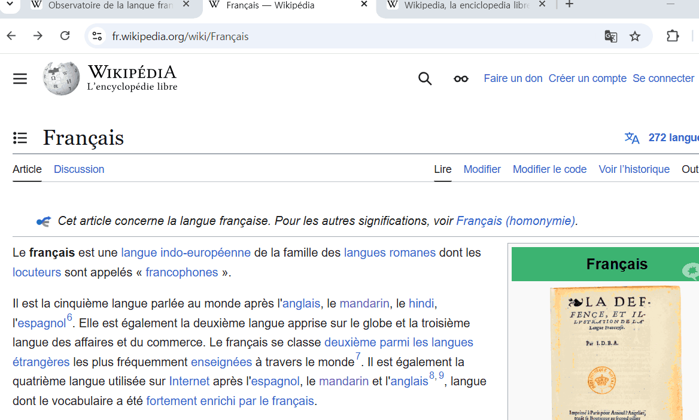
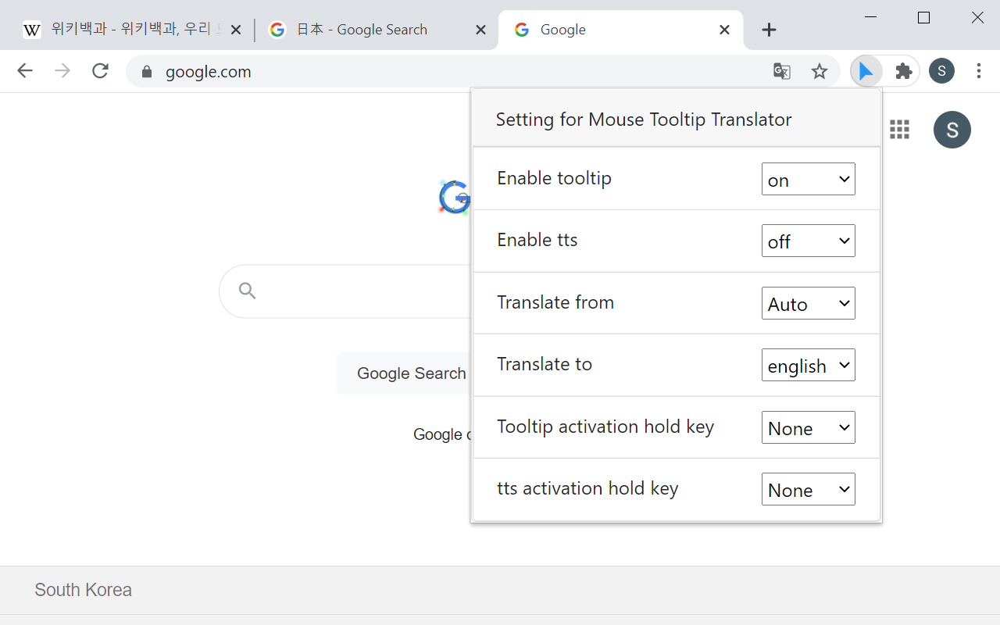
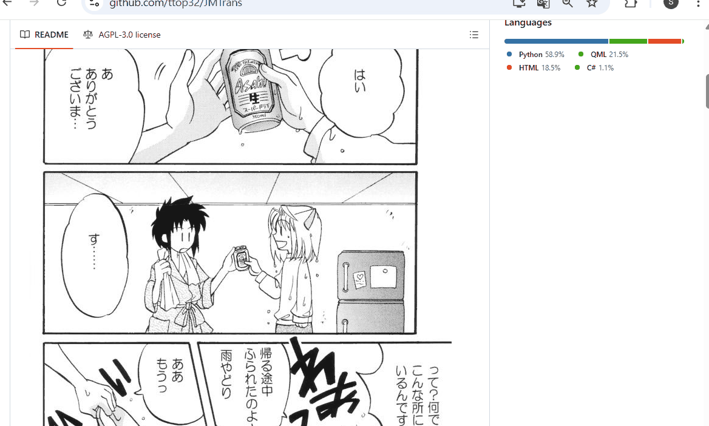

# MouseTooltipTranslator  

[](https://chromewebstore.google.com/detail/hmigninkgibhdckiaphhmbgcghochdjc)
[](https://chromewebstore.google.com/detail/hmigninkgibhdckiaphhmbgcghochdjc)
 
Mouseover Translate Any Language At Once - Chrome Extension  
   
Download from [chrome web store](https://chromewebstore.google.com/detail/hmigninkgibhdckiaphhmbgcghochdjc), [Edge Extension store](https://microsoftedge.microsoft.com/addons/detail/mouse-tooltip-translator/nnodgmifnfgkolmakhcfkkbbjjcobhbl) and [Firefox Addons](https://addons.mozilla.org/en-US/firefox/addon/mouse-tooltip-translator-pdf/)

   
[](https://chrome.google.com/webstore/detail/mouse-tooltip-translator/hmigninkgibhdckiaphhmbgcghochdjc)
[](https://microsoftedge.microsoft.com/addons/detail/mouse-tooltip-translator/nnodgmifnfgkolmakhcfkkbbjjcobhbl)
[](https://addons.mozilla.org/en-US/firefox/addon/mouse-tooltip-translator-pdf/)
[](https://www.softpedia.com/get/Internet/Internet-Applications-Addons/Chrome-Extensions/Mouse-Tooltip-Translator-for-Chrome.shtml)

# Result   
    


 


# Features
 
- Hover or select (highlight) on text to translate  
- Use left ctrl to Listen pronunciation with google TTS (text to speech)
- Use right alt to translate writing text in input box (or highlighted text)
- Google translator and bing translator are used for translation
- Support pdf to display translated tooltip using PDF.js
- Support dual subtitles for youtube video
- Process OCR when hold left shift and mouse over on image (ex manga)
- Translate with Speech recognition

# How to use
- [How to use](https://github.com/ttop32/MouseTooltipTranslator/blob/main/doc/intro.md#how-to-use)

# Build yourself to install

1. Install node js, <https://nodejs.org/en/> , node 18
2. open terminal and type below

```console
git clone https://github.com/ttop32/MouseTooltipTranslator.git
cd MouseTooltipTranslator
npm install 
npm run build        // or 'npm run watch' for developing
```

3. You will see MouseTooltipTranslator/build path
4. Open chrome browser and goto chrome://extensions/
5. Turn on top right corner developer mode
6. Open the folder (MouseTooltipTranslator/build) as unpacked extension folder


# Contributors
<!-- readme: contributors -start -->
<table>
<tr>
    <td align="center">
        <a href="https://github.com/ttop32">
            
            <br />
            <sub><b>Daniel K</b></sub>
        </a>
    </td>
    <td align="center">
        <a href="https://github.com/ardasatata">
            
            <br />
            <sub><b>Arda Satata Fitriajie</b></sub>
        </a>
    </td>
    <td align="center">
        <a href="https://github.com/neoOpus">
            
            <br />
            <sub><b>Anoir Ben Tanfous</b></sub>
        </a>
    </td>
    <td align="center">
        <a href="https://github.com/lg28literconvectionmicrowaveoven">
            
            <br />
            <sub><b>Lg28literconvectionmicrowaveoven</b></sub>
        </a>
    </td>
    <td align="center">
        <a href="https://github.com/Blueberryy">
            
            <br />
            <sub><b>Null</b></sub>
        </a>
    </td>
    <td align="center">
        <a href="https://github.com/michael-nhat">
            
            <br />
            <sub><b>Hoang Van Nhat</b></sub>
        </a>
    </td></tr>
<tr>
    <td align="center">
        <a href="https://github.com/newmind">
            
            <br />
            <sub><b>JG</b></sub>
        </a>
    </td>
    <td align="center">
        <a href="https://github.com/SFGFDSD">
            
            <br />
            <sub><b>Null</b></sub>
        </a>
    </td>
    <td align="center">
        <a href="https://github.com/di4m0nds">
            
            <br />
            <sub><b>Silvestri, Javier</b></sub>
        </a>
    </td>
    <td align="center">
        <a href="https://github.com/netanelavi">
            
            <br />
            <sub><b>Null</b></sub>
        </a>
    </td></tr>
</table>
<!-- readme: contributors -end -->


# Contributors Crowdin

<!-- CROWDIN-CONTRIBUTORS-START -->
<table>
  <tr>
    <td align="center" valign="top">
      <a href="https://crowdin.com/profile/ttop32">
        <br />
        <sub><b>daniel k (ttop32)</b></sub></a>
      <br />
      <sub><b>10218 words</b></sub>
      <br /><sub><b><code title="Amharic">am</code></b>, <b><code title="Arabic">ar</code></b>, <b><code title="Bengali">bn</code></b>, <b><code title="Bulgarian">bg</code></b>, <b><code title="Catalan">ca</code></b>, <b><code title="Chinese Simplified">zh-CN</code></b>, <b><code title="Chinese Traditional">zh-TW</code></b>, <b><code title="Croatian">hr</code></b>, <b><code title="Czech">cs</code></b>, <b><code title="Danish">da</code></b>, <b><code title="Dutch">nl</code></b>, <b><code title="English, Australia">en-AU</code></b>, <b><code title="English, United Kingdom">en-GB</code></b>, <b><code title="English, United States">en-US</code></b>, <b><code title="Estonian">et</code></b>, <b><code title="Filipino">fil</code></b>, <b><code title="Finnish">fi</code></b>, <b><code title="French">fr</code></b>, <b><code title="German">de</code></b>, <b><code title="Greek">el</code></b>, <b><code title="Gujarati">gu-IN</code></b>, <b><code title="Hebrew">he</code></b>, <b><code title="Hindi">hi</code></b>, <b><code title="Hungarian">hu</code></b>, <b><code title="Indonesian">id</code></b>, <b><code title="Italian">it</code></b>, <b><code title="Japanese">ja</code></b>, <b><code title="Kannada">kn</code></b>, <b><code title="Korean">ko</code></b>, <b><code title="Latvian">lv</code></b>, <b><code title="Lithuanian">lt</code></b>, <b><code title="Malay">ms</code></b>, <b><code title="Malayalam">ml-IN</code></b>, <b><code title="Marathi">mr</code></b>, <b><code title="Norwegian">no</code></b>, <b><code title="Persian">fa</code></b>, <b><code title="Polish">pl</code></b>, <b><code title="Portuguese">pt-PT</code></b>, <b><code title="Portuguese, Brazilian">pt-BR</code></b>, <b><code title="Romanian">ro</code></b>, <b><code title="Russian">ru</code></b>, <b><code title="Serbian (Cyrillic)">sr</code></b>, <b><code title="Slovak">sk</code></b>, <b><code title="Slovenian">sl</code></b>, <b><code title="Spanish">es-ES</code></b>, <b><code title="Spanish, Latin America">es-419</code></b>, <b><code title="Swahili">sw</code></b>, <b><code title="Swedish">sv-SE</code></b>, <b><code title="Tamil">ta</code></b>, <b><code title="Telugu">te</code></b>, <b><code title="Thai">th</code></b>, <b><code title="Turkish">tr</code></b>, <b><code title="Ukrainian">uk</code></b>, <b><code title="Vietnamese">vi</code></b></sub>
    </td>
    <td align="center" valign="top">
      <a href="https://crowdin.com/profile/D0n-A">
        <br />
        <sub><b>D0n-A</b></sub></a>
      <br />
      <sub><b>358 words</b></sub>
      <br /><sub><b><code title="English, United States">en-US</code></b>, <b><code title="Russian">ru</code></b></sub>
    </td>
    <td align="center" valign="top">
      <a href="https://crowdin.com/profile/SFGFDSD">
        <br />
        <sub><b>SFGFDSD</b></sub></a>
      <br />
      <sub><b>352 words</b></sub>
      <br /><sub><b><code title="Chinese Simplified">zh-CN</code></b>, <b><code title="Chinese Traditional">zh-TW</code></b></sub>
    </td>
    <td align="center" valign="top">
      <a href="https://crowdin.com/profile/s-upakit">
        <br />
        <sub><b>s-upakit</b></sub></a>
      <br />
      <sub><b>234 words</b></sub>
      <br /><sub><b><code title="Thai">th</code></b></sub>
    </td>
    <td align="center" valign="top">
      <a href="https://crowdin.com/profile/Eduardo_91">
        <br />
        <sub><b>Eduardo_91</b></sub></a>
      <br />
      <sub><b>207 words</b></sub>
      <br /><sub><b><code title="Portuguese, Brazilian">pt-BR</code></b></sub>
    </td>
  </tr>
  <tr>
    <td align="center" valign="top">
      <a href="https://crowdin.com/profile/Nhoxpipicool">
        <br />
        <sub><b>Duong.Kayce (Nhoxpipicool)</b></sub></a>
      <br />
      <sub><b>192 words</b></sub>
      <br /><sub><b><code title="Vietnamese">vi</code></b></sub>
    </td>
    <td align="center" valign="top">
      <a href="https://crowdin.com/profile/merlette">
        <br />
        <sub><b>Logan Shen (merlette)</b></sub></a>
      <br />
      <sub><b>88 words</b></sub>
      <br /><sub><b><code title="Chinese Simplified">zh-CN</code></b>, <b><code title="Chinese Traditional">zh-TW</code></b></sub>
    </td>
    <td align="center" valign="top">
      <a href="https://crowdin.com/profile/Mirnyang">
        <br />
        <sub><b>미르냥 (Mirnyang)</b></sub></a>
      <br />
      <sub><b>83 words</b></sub>
      <br /><sub><b><code title="Korean">ko</code></b></sub>
    </td>
    <td align="center" valign="top">
      <a href="https://crowdin.com/profile/odk-0160">
        <br />
        <sub><b>ODK (odk-0160)</b></sub></a>
      <br />
      <sub><b>83 words</b></sub>
      <br /><sub><b><code title="Turkish">tr</code></b></sub>
    </td>
    <td align="center" valign="top">
      <a href="https://crowdin.com/profile/helimoreira">
        <br />
        <sub><b>Heliana Moreira (helimoreira)</b></sub></a>
      <br />
      <sub><b>73 words</b></sub>
      <br /><sub><b><code title="Portuguese, Brazilian">pt-BR</code></b></sub>
    </td>
  </tr>
  <tr>
    <td align="center" valign="top">
      <a href="https://crowdin.com/profile/neoOpus">
        <br />
        <sub><b>Anwar Ben Tanfous (neoOpus)</b></sub></a>
      <br />
      <sub><b>73 words</b></sub>
      <br /><sub><b><code title="Arabic">ar</code></b></sub>
    </td>
    <td align="center" valign="top">
      <a href="https://crowdin.com/profile/nejdetacar">
        <br />
        <sub><b>Nejdet ACAR (nejdetacar)</b></sub></a>
      <br />
      <sub><b>63 words</b></sub>
      <br /><sub><b><code title="Turkish">tr</code></b></sub>
    </td>
    <td align="center" valign="top">
      <a href="https://crowdin.com/profile/EdsonBittencourt">
        <br />
        <sub><b>EdsonBittencourt</b></sub></a>
      <br />
      <sub><b>57 words</b></sub>
      <br /><sub><b><code title="Portuguese, Brazilian">pt-BR</code></b></sub>
    </td>
    <td align="center" valign="top">
      <a href="https://crowdin.com/profile/SamoE">
        <br />
        <sub><b>Samo (SamoE)</b></sub></a>
      <br />
      <sub><b>31 words</b></sub>
      <br /><sub><b><code title="Turkish">tr</code></b></sub>
    </td>
    <td align="center" valign="top">
      <a href="https://crowdin.com/profile/annatomika.one">
        <br />
        <sub><b>ID Hunter (ASAP) (annatomika.one)</b></sub></a>
      <br />
      <sub><b>27 words</b></sub>
      <br /><sub><b><code title="Russian">ru</code></b></sub>
    </td>
  </tr>
  <tr>
    <td align="center" valign="top">
      <a href="https://crowdin.com/profile/Amydette">
        <br />
        <sub><b>Amydette</b></sub></a>
      <br />
      <sub><b>24 words</b></sub>
      <br /><sub><b><code title="Filipino">fil</code></b></sub>
    </td>
    <td align="center" valign="top">
      <a href="https://crowdin.com/profile/CreeperYeeter2">
        <br />
        <sub><b>CreeperYeeter2</b></sub></a>
      <br />
      <sub><b>13 words</b></sub>
      <br /><sub><b><code title="English, Australia">en-AU</code></b></sub>
    </td>
    <td align="center" valign="top">
      <a href="https://crowdin.com/profile/TTT01">
        <br />
        <sub><b>IT SUPPORT (TTT01)</b></sub></a>
      <br />
      <sub><b>3 words</b></sub>
      <br /><sub><b><code title="Thai">th</code></b></sub>
    </td>
    <td align="center" valign="top">
      <a href="https://crowdin.com/profile/n3g">
        <br />
        <sub><b>n3g</b></sub></a>
      <br />
      <sub><b>3 words</b></sub>
      <br /><sub><b><code title="Russian">ru</code></b></sub>
    </td>
  </tr>
</table><a href="https://crowdin.com/project/mousetooltiptranslator" target="_blank">Translate in Crowdin 🚀</a>
<!-- CROWDIN-CONTRIBUTORS-END -->
  
- We are looking for any localization contributor. Feel free to make contribution on crowdin.  


# Change Log
- [Change Log](https://github.com/ttop32/MouseTooltipTranslator/blob/main/doc/description.md#change-log)

# Privacy policy
- [Privacy policy](https://github.com/ttop32/MouseTooltipTranslator/blob/main/doc/privacy_policy.md)

# Acknowledgement and References  

- [Chrome Extension CLI](https://www.npmjs.com/package/chrome-extension-cli)
- [TransOver](https://github.com/artemave/translate_onhover)
- [Cool Tooltip Dictionary 14](https://github.com/yakolla/HoveringDictionary)
- [Google Dictionary (by Google)](https://chrome.google.com/webstore/detail/google-dictionary-by-goog/mgijmajocgfcbeboacabfgobmjgjcoja?hl=en)
- [jquery](https://www.npmjs.com/package/jquery)
- [bootstrap](https://www.npmjs.com/package/bootstrap)
- [Isolate-Bootstrap](https://github.com/cryptoapi/Isolate-Bootstrap-4.1-CSS-Themes)
- [pdf.js](https://mozilla.github.io/pdf.js/)
- [Read Aloud]( https://github.com/ken107/read-aloud)
- [PDF Reader](https://github.com/Emano-Waldeck/pdf-reader)
- [opencv.js](https://docs.opencv.org/4.5.1/df/df7/tutorial_js_table_of_contents_setup.html)
- [tesseract.js](https://github.com/naptha/tesseract.js)
- [jpn_vert](https://github.com/zodiac3539/jpn_vert)
- [bubble reader](https://m.blog.naver.com/PostView.nhn?blogId=waltherp38&logNo=221116037039&proxyReferer=https:%2F%2Fwww.google.com%2F)
- [mouse pointer](https://www.flaticon.com/free-icon/mouse-pointer_889858?term=mouse&page=1&position=34&related_item_id=889858)
- [miricanvas](https://www.miricanvas.com/)
- [Vue.js](https://vuejs.org/)
- [vuetify](https://vuetifyjs.com/en/)
- [bing-translate-api](https://github.com/plainheart/bing-translate-api)
- [floodFill](https://codepen.io/Geeyoam/pen/vLGZzG)
- [trimCanvas](https://gist.github.com/remy/784508)
- [floating-maple-leaf](https://www.freeimages.com/photo/floating-maple-leaf-1171688)
- [EdgeTranslate](https://github.com/EdgeTranslate/EdgeTranslate)
- [translatte](https://github.com/extensionsapp/translatte)
- [doq](https://github.com/shivaprsd/doq)
- [foliate-js](https://github.com/johnfactotum/foliate-js)
- [google-translate-api](https://github.com/vitalets/google-translate-api)
- [crx-live-translate](https://github.com/botbahlul/crx-live-translate/tree/main)
- [voice-driven-web-apps-introduction](https://developer.chrome.com/blog/voice-driven-web-apps-introduction-to-the-web-speech-api)
- [review by MagmaChipmunk](https://twitter.com/MagmaChipmunk/status/1348144312605806594)
- [review by doitreview](https://doitreview.tistory.com/68?category=915950)
- [review by parbat0305](https://parbat0305.tistory.com/527)
- [review by quantumgaea](https://blog.naver.com/quantumgaea/222254404573)
- [review by eduvantage](https://blog.naver.com/eduvantage/222253462689)
- [review by webiitoko](https://webiitoko.blog.fc2.com/blog-entry-1086.html)
- [review by Joost Dancet](https://taalextensies.wordpress.com/mouse-tooltip-translator/)
- [review by Sigit Khoirul Anam](https://www.youtube.com/watch?v=flC9i_7uoho)
