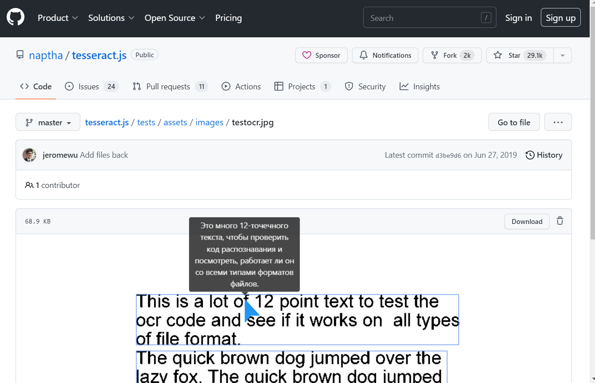

# MouseTooltipTranslator  

[](https://chromewebstore.google.com/detail/hmigninkgibhdckiaphhmbgcghochdjc)
[](https://chromewebstore.google.com/detail/hmigninkgibhdckiaphhmbgcghochdjc)

Mouseover Translate Any Language At Once - Chrome Extension 

Download from [chrome web store](https://chromewebstore.google.com/detail/hmigninkgibhdckiaphhmbgcghochdjc) and [Edge Extension store](https://microsoftedge.microsoft.com/addons/detail/mouse-tooltip-translator/nnodgmifnfgkolmakhcfkkbbjjcobhbl)
  
[](https://chrome.google.com/webstore/detail/mouse-tooltip-translator/hmigninkgibhdckiaphhmbgcghochdjc)
[](https://microsoftedge.microsoft.com/addons/detail/mouse-tooltip-translator/nnodgmifnfgkolmakhcfkkbbjjcobhbl)
[](https://www.softpedia.com/get/Internet/Internet-Applications-Addons/Chrome-Extensions/Mouse-Tooltip-Translator-for-Chrome.shtml)

# Result





# Features

- Hover or select (highlight) on text to translate  
- Use left ctrl to Listen pronunciation with google TTS (text to speech)
- Use right alt to translate writing text in input box (or highlighted text)
- Google translator and bing translator are used for translation
- Support pdf to display translated tooltip using PDF.js
- Support dual subtitles for youtube video
- Process OCR when hold left shift and mouse over on image (ex manga)

# How to use
- [How to use](https://github.com/ttop32/MouseTooltipTranslator/blob/main/doc/intro.md#how-to-use)

# Change Log
- [Change Log](https://github.com/ttop32/MouseTooltipTranslator/blob/main/doc/description.md#change-log)


  
# Contributors
<!-- readme: contributors -start -->
<table>
<tr>
    <td align="center">
        <a href="https://github.com/ttop32">
            
            <br />
            <sub><b>Daniel K</b></sub>
        </a>
    </td>
    <td align="center">
        <a href="https://github.com/ardasatata">
            
            <br />
            <sub><b>Arda Satata Fitriajie</b></sub>
        </a>
    </td>
    <td align="center">
        <a href="https://github.com/neoOpus">
            
            <br />
            <sub><b>Anoir Ben Tanfous</b></sub>
        </a>
    </td>
    <td align="center">
        <a href="https://github.com/Blueberryy">
            
            <br />
            <sub><b>Null</b></sub>
        </a>
    </td>
    <td align="center">
        <a href="https://github.com/michael-nhat">
            
            <br />
            <sub><b>Hoang Van Nhat</b></sub>
        </a>
    </td>
    <td align="center">
        <a href="https://github.com/newmind">
            
            <br />
            <sub><b>JG</b></sub>
        </a>
    </td></tr>
<tr>
    <td align="center">
        <a href="https://github.com/netanel123123">
            
            <br />
            <sub><b>Null</b></sub>
        </a>
    </td></tr>
</table>
<!-- readme: contributors -end -->


# Build yourself to install

1. Install node js, <https://nodejs.org/en/> , node 18
2. open terminal and type below

```console
git clone https://github.com/ttop32/MouseTooltipTranslator.git
cd MouseTooltipTranslator
npm install 
npm run build        // or 'npm run watch' for developing
```

3. You will see MouseTooltipTranslator/build path
4. Open chrome browser and goto chrome://extensions/
5. Turn on top right corner developer mode
6. Open the folder (MouseTooltipTranslator/build) as unpacked extension folder


# Language locale
- We are looking for any locale contributor. Feel free to make any pull request on bellow path.  
  - [Locale](https://github.com/ttop32/MouseTooltipTranslator/tree/main/public/_locales)  
- User can change this extension user interface Language by change browser UI language from   
  - [chrome://settings/languages](chrome://settings/languages)  
 


| Locale code | Language (region) |
| ------------- | ------------- |
| ar  | Arabic |
| am  | Amharic |
| bg  | Bulgarian |
| bn  | Bengali |
| ca  | Catalan |
| cs  | Czech |
| da  | Danish |
| de  | German |
| el  | Greek |
| en  | English |
| en_AU  | English (Australia) |
| en_GB  | English (Great Britain) |
| en_US  | English (USA) |
| es  | Spanish |
| es_419  | Spanish (Latin America and Caribbean) |
| et  | Estonian |
| fa  | Persian |
| fi  | Finnish |
| fil  | Filipino |
| fr  | French |
| gu  | Gujarati |
| he  | Hebrew |
| hi  | Hindi |
| hr  | Croatian |
| hu  | Hungarian |
| id  | Indonesian |
| it  | Italian |
| ja  | Japanese |
| kn  | Kannada |
| ko  | Korean |
| lt  | Lithuanian |
| lv  | Latvian |
| ml  | Malayalam |
| mr  | Marathi |
| ms  | Malay |
| nl  | Dutch |
| no  | Norwegian |
| pl  | Polish |
| pt_BR  | Portuguese (Brazil) |
| pt_PT  | Portuguese (Portugal) |
| ro  | Romanian |
| ru  | Russian |
| sk  | Slovak |
| sl  | Slovenian |
| sr  | Serbian |
| sv  | Swedish |
| sw  | Swahili |
| ta  | Tamil |
| te  | Telugu |
| th  | Thai |
| tr  | Turkish |
| uk  | Ukrainian |
| vi  | Vietnamese |
| zh_CN  | Chinese (China) |
| zh_TW  | Chinese (Taiwan) |


# Privacy policy
- [Privacy policy](https://github.com/ttop32/MouseTooltipTranslator/blob/main/doc/privacy_policy.md)

# Acknowledgement and References  

- [Chrome Extension CLI](https://www.npmjs.com/package/chrome-extension-cli)
- [TransOver](https://github.com/artemave/translate_onhover)
- [Cool Tooltip Dictionary 14](https://github.com/yakolla/HoveringDictionary)
- [Google Dictionary (by Google)](https://chrome.google.com/webstore/detail/google-dictionary-by-goog/mgijmajocgfcbeboacabfgobmjgjcoja?hl=en)
- [jquery](https://www.npmjs.com/package/jquery)
- [bootstrap](https://www.npmjs.com/package/bootstrap)
- [Isolate-Bootstrap](https://github.com/cryptoapi/Isolate-Bootstrap-4.1-CSS-Themes)
- [pdf.js](https://mozilla.github.io/pdf.js/)
- [Read Aloud]( https://github.com/ken107/read-aloud)
- [PDF Reader](https://github.com/Emano-Waldeck/pdf-reader)
- [opencv.js](https://docs.opencv.org/4.5.1/df/df7/tutorial_js_table_of_contents_setup.html)
- [tesseract.js](https://github.com/naptha/tesseract.js)
- [jpn_vert](https://github.com/zodiac3539/jpn_vert)
- [bubble reader](https://m.blog.naver.com/PostView.nhn?blogId=waltherp38&logNo=221116037039&proxyReferer=https:%2F%2Fwww.google.com%2F)
- [mouse pointer](https://www.flaticon.com/free-icon/mouse-pointer_889858?term=mouse&page=1&position=34&related_item_id=889858)
- [miricanvas](https://www.miricanvas.com/)
- [Vue.js](https://vuejs.org/)
- [vuetify](https://vuetifyjs.com/en/)
- [bing-translate-api](https://github.com/plainheart/bing-translate-api)
- [floodFill](https://codepen.io/Geeyoam/pen/vLGZzG)
- [trimCanvas](https://gist.github.com/remy/784508)
- [floating-maple-leaf](https://www.freeimages.com/photo/floating-maple-leaf-1171688)
- [EdgeTranslate](https://github.com/EdgeTranslate/EdgeTranslate)
- [translatte](https://github.com/extensionsapp/translatte)
- [doq](https://github.com/shivaprsd/doq)
- [foliate-js](https://github.com/johnfactotum/foliate-js)
- [google-translate-api](https://github.com/vitalets/google-translate-api)
- [review by MagmaChipmunk](https://twitter.com/MagmaChipmunk/status/1348144312605806594)
- [review by doitreview](https://doitreview.tistory.com/68?category=915950)
- [review by parbat0305](https://parbat0305.tistory.com/527)
- [review by quantumgaea](https://blog.naver.com/quantumgaea/222254404573)
- [review by eduvantage](https://blog.naver.com/eduvantage/222253462689)
- [review by webiitoko](https://webiitoko.blog.fc2.com/blog-entry-1086.html)
- [review by Joost Dancet](https://taalextensies.wordpress.com/mouse-tooltip-translator/)
- [review by Sigit Khoirul Anam](https://www.youtube.com/watch?v=flC9i_7uoho)
