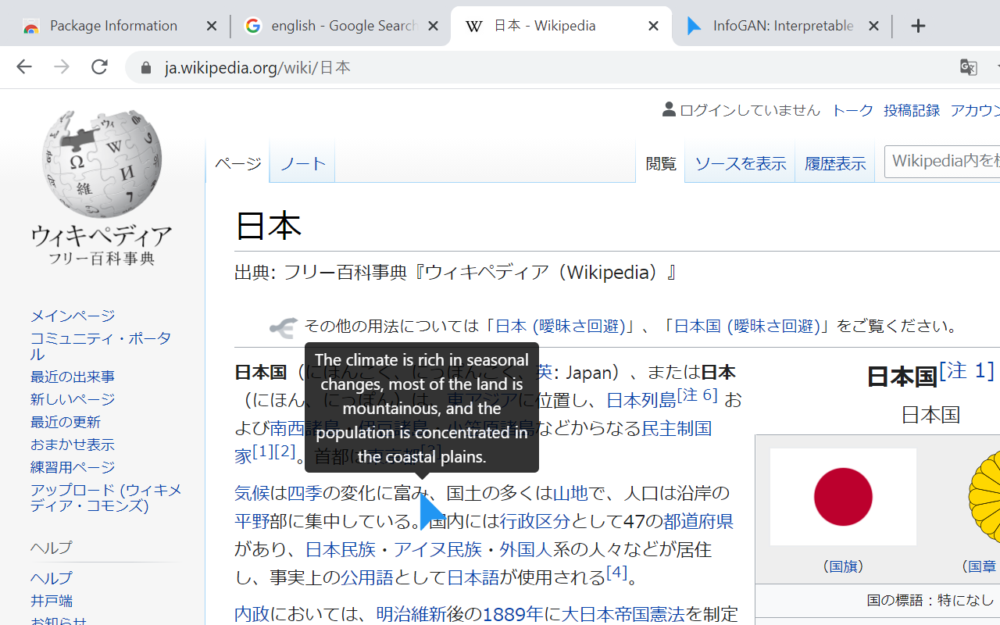
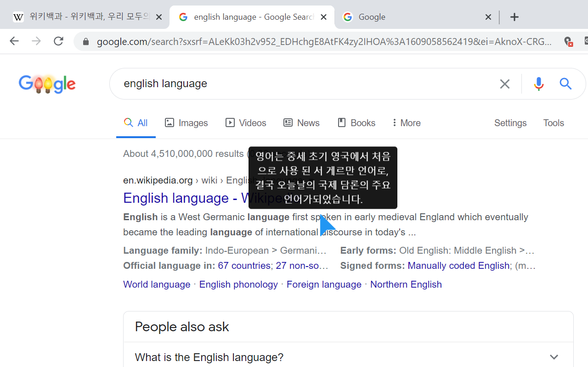
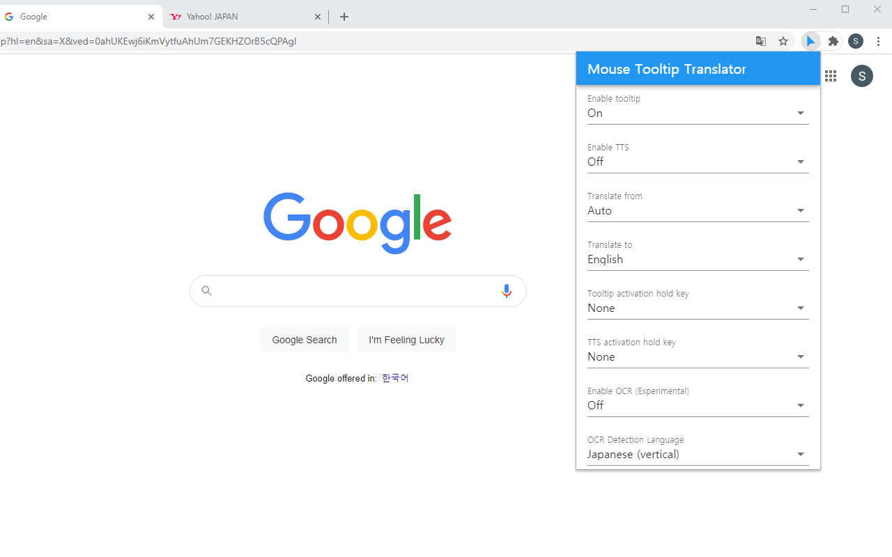

# MouseTooltipTranslator  
[](https://chrome.google.com/webstore/detail/mouse-tooltip-translator/hmigninkgibhdckiaphhmbgcghochdjc) 
[](https://chrome.google.com/webstore/detail/mouse-tooltip-translator/hmigninkgibhdckiaphhmbgcghochdjc) 


Chrome extension for mouseover translation - Mouse over to translate using google translate        
When mouse hover on text, it shows translated tooltip in any desired language.    


download from [chrome web store](https://chrome.google.com/webstore/detail/mouse-tooltip-translator/hmigninkgibhdckiaphhmbgcghochdjc?hl=en) and [Edge Extension store](https://microsoftedge.microsoft.com/addons/detail/mouse-tooltip-translator/nnodgmifnfgkolmakhcfkkbbjjcobhbl) 
  
[](https://chrome.google.com/webstore/detail/mouse-tooltip-translator/hmigninkgibhdckiaphhmbgcghochdjc?hl=en)
[](https://microsoftedge.microsoft.com/addons/detail/mouse-tooltip-translator/nnodgmifnfgkolmakhcfkkbbjjcobhbl)
[](https://www.softpedia.com/get/Internet/Internet-Applications-Addons/Chrome-Extensions/Mouse-Tooltip-Translator-for-Chrome.shtml)


# Result   

    
     
    
    
    
    

# Features   
- Visualise tooltip on any web page (except chrome web store site)  
- Using google translate to translate in any language   
- In the setting, google tts (text to speech) is available to listen text   
- Support pdf to display translated tooltip using Mozilla PDF.js   
- Filter out when source language and target language are same    
- process OCR when mouse over on image      
  
# Contributors
- [sanprojects](https://github.com/sanprojects)
- [Blueberryy](https://github.com/Blueberryy)
- [neoOpus](https://github.com/neoOpus)

# Change Log
- [Change Log](https://github.com/ttop32/MouseTooltipTranslator/blob/main/doc/description.md#change-log)   

# Language locale
- [Locale](https://github.com/ttop32/MouseTooltipTranslator/tree/main/public/_locales)

# Build yourself to install
1. Install node js, https://nodejs.org/en/
2. open terminal and type below
```
git clone https://github.com/ttop32/MouseTooltipTranslator.git
cd MouseTooltipTranslator
npm install 
npm run build        # or 'npm run watch' for developing
```
3. You will see MouseTooltipTranslator/build path
4. Open chrome browser and goto chrome://extensions/
5. Turn on top right corner developer mode 
6. Open the folder (MouseTooltipTranslator/build) as unpacked extension folder

# OCR
- Japanese OCR uses https://github.com/ttop32/jpn_vert_traineddata

# Privacy policy
- Mouse tooltip translator uses user data only for google translation(tts) purpose.   
- It does not share any user data with any other third parties.   

# Acknowledgement and References  
- [Chrome Extension CLI](https://www.npmjs.com/package/chrome-extension-cli)     
- [TransOver](https://github.com/artemave/translate_onhover)     
- [Cool Tooltip Dictionary 14](https://github.com/yakolla/HoveringDictionary)     
- [Google Dictionary (by Google)](https://chrome.google.com/webstore/detail/google-dictionary-by-goog/mgijmajocgfcbeboacabfgobmjgjcoja?hl=en)     
- [jquery](https://www.npmjs.com/package/jquery)    
- [bootstrap](https://www.npmjs.com/package/bootstrap)     
- [Isolate-Bootstrap](https://github.com/cryptoapi/Isolate-Bootstrap-4.1-CSS-Themes)    
- [pdf.js](https://mozilla.github.io/pdf.js/)    
- [Read Aloud]( https://github.com/ken107/read-aloud)     
- [PDF Reader](https://github.com/Emano-Waldeck/pdf-reader)
- [opencv.js](https://docs.opencv.org/4.5.1/df/df7/tutorial_js_table_of_contents_setup.html)
- [tesseract.js](https://github.com/naptha/tesseract.js)
- [jpn_vert](https://github.com/zodiac3539/jpn_vert)
- [bubble reader](https://m.blog.naver.com/PostView.nhn?blogId=waltherp38&logNo=221116037039&proxyReferer=https:%2F%2Fwww.google.com%2F)
- [mouse pointer](https://www.flaticon.com/free-icon/mouse-pointer_889858?term=mouse&page=1&position=34&related_item_id=889858)    
- [miricanvas](https://www.miricanvas.com/)
- [Vue.js](https://vuejs.org/)
- [vuetify](https://vuetifyjs.com/en/)
- [bing-translate-api](https://github.com/plainheart/bing-translate-api)
- [floodFill](https://codepen.io/Geeyoam/pen/vLGZzG)
- [trimCanvas](https://gist.github.com/remy/784508)
- [floating-maple-leaf](https://www.freeimages.com/photo/floating-maple-leaf-1171688)
- [EdgeTranslate](https://github.com/EdgeTranslate/EdgeTranslate)
- [translatte](https://github.com/extensionsapp/translatte)
- [doq](https://github.com/shivaprsd/doq)
- [google-translate-api](https://github.com/vitalets/google-translate-api)
- [review by MagmaChipmunk](https://twitter.com/MagmaChipmunk/status/1348144312605806594)
- [review by doitreview](https://doitreview.tistory.com/68?category=915950)
- [review by parbat0305](https://parbat0305.tistory.com/527)
- [review by quantumgaea](https://blog.naver.com/quantumgaea/222254404573)
- [review by yyaasema](https://blog.naver.com/yyaasema/222251147172)
- [review by eduvantage](https://blog.naver.com/eduvantage/222253462689)
- [review by webiitoko](https://webiitoko.blog.fc2.com/blog-entry-1086.html)
- [review by Jukka Melaranta](https://saaressa.blogspot.com/2021/08/mouse-tooltip-translator.html)
- [review by Joost Dancet](https://taalextensies.wordpress.com/mouse-tooltip-translator/)
- [review by Sigit Khoirul Anam](https://www.youtube.com/watch?v=flC9i_7uoho)


